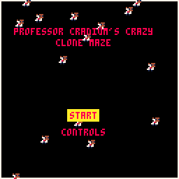

# README
## Description
A simple platformer with an interesting cloning mechanic, made (in 2 days) as part of the Fall 2019 WMU Computer Club game jam.

## STARTING THE GAME
Provided in this repo is the original Pico-8 source code for Profrssor Cranium's Crazy Clone Maze (PCCCM)
as well as a HTML/JS port of the game. 
+ Option 1:  
      If you have Pico-8, you can just download the pcccm.p8 cart and load/run
      it within Pico-8. 
+ Option 2:  
      You may download the pcccm_html folder and play PCCCM through your browser. Just open the 
      index.html file using your browser of choice (I know Chrome works) and you should be good to go!
+ Option 3:  
    [Play on itch.io](https://charlesddnoble.itch.io/pcccm)
## Controls
Start Menu Movement: Arrow UP/DOWN  
Start Menu Select: X  
Player Movement: Arrow Keys  
Interact W/Clone Vat: C  
Clone Movement: E S D F  

Thanks for playing!
